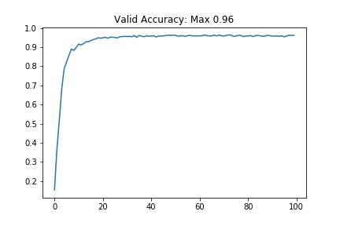

## Project: Build a Traffic Sign Recognition Program

Overview
---
Dataset: [German Traffic Sign Dataset](http://benchmark.ini.rub.de/?section=gtsrb&subsection=dataset)

The Project
---
The goals / steps of this project are the following:
* Load the data set
* Explore, summarize and visualize the data set
* Design, train and test a model architecture
* Use the model to make predictions on new images
* Analyze the softmax probabilities of the new images
* Summarize the results with a written report

### Dataset Exploration

> Dataset Summary
* Number of training examples = 34799
* Number of testing examples = 12630
* Image data shape = (32, 32, 3)
* Number of classes = 43

> Exploratory Visualization

### Design and Test a Model Architecture

> Preprocessing
* Images were normalized so that images have zero mean and equal variance.
* X_train_norm = np.divide(np.subtract(X_train, 128), 128)
* X_valid_norm = np.divide(np.subtract(X_valid, 128), 128)
* X_test_norm = np.divide(np.subtract(X_test, 128), 128)

> Model Architecture
* The model has 3 Convolutional Layers and 3 Fully Connected Layers. Dropout layer has been added after each fully connected layer.

def Net(x):    
    mu = 0
    sigma = 0.1
    #
    # SOLUTION: Layer 1: Convolutional. Input = 32x32x3. Output = 30x30x16.
    conv1_W = tf.Variable(tf.truncated_normal(shape=(3, 3, 3, 16), mean=mu, stddev=sigma))
    conv1_b = tf.Variable(tf.zeros(16))
    conv1   = tf.nn.conv2d(x, conv1_W, strides=[1, 1, 1, 1], padding='VALID') + conv1_b
    #
    # SOLUTION: Activation.
    conv1 = tf.nn.relu(conv1)
    #
    # SOLUTION: Pooling. Input = 30x30x16. Output = 15x15x16.
    conv1 = tf.nn.max_pool(conv1, ksize=[1, 2, 2, 1], strides=[1, 2, 2, 1], padding='VALID')
    #
    # SOLUTION: Layer 2: Convolutional. Output = 13x13x32.
    conv2_W = tf.Variable(tf.truncated_normal(shape=(3, 3, 16, 64), mean = mu, stddev = sigma))
    conv2_b = tf.Variable(tf.zeros(64))
    conv2   = tf.nn.conv2d(conv1, conv2_W, strides=[1, 1, 1, 1], padding='VALID') + conv2_b
    #
    # SOLUTION: Activation.
    conv2 = tf.nn.relu(conv2)
    #
    # SOLUTION: Pooling. Input = 13x13x64. Output = 6x6x64.
    conv2 = tf.nn.max_pool(conv2, ksize=[1, 2, 2, 1], strides=[1, 2, 2, 1], padding='VALID')
    #
    # SOLUTION: Layer 3: Convolutional. Input=6x6x64,  Output = 4x4x128.
    conv3_W = tf.Variable(tf.truncated_normal(shape=(3, 3, 64, 128), mean = mu, stddev = sigma))
    conv3_b = tf.Variable(tf.zeros(128))
    conv3   = tf.nn.conv2d(conv2, conv3_W, strides=[1, 1, 1, 1], padding='VALID') + conv3_b
    #
    # SOLUTION: Activation.
    conv3 = tf.nn.relu(conv3)
    #
    # SOLUTION: Pooling. Input=4x4x64. Output=2x2x128.
    conv3 = tf.nn.max_pool(conv3, ksize=[1, 2, 2, 1], strides=[1, 2, 2, 1], padding='VALID')
    #
    # SOLUTION: Flatten. Input = 5x5x16. Output = 400.
    fc0   = flatten(conv3)
    #
    fc0 = tf.nn.dropout(fc0, 0.8)
    #
    # SOLUTION: Layer 4: Fully Connected. Input = 400. Output = 120.
    fc1_W = tf.Variable(tf.truncated_normal(shape=(2*2*128, 120), mean = mu, stddev = sigma))
    fc1_b = tf.Variable(tf.zeros(120))
    fc1   = tf.matmul(fc0, fc1_W) + fc1_b
    #
    # SOLUTION: Activation.
    fc1    = tf.nn.relu(fc1)
    #
    fc1 = tf.nn.dropout(fc1, 0.8)
    #
    # SOLUTION: Layer 5: Fully Connected. Input = 120. Output = 84.
    fc2_W  = tf.Variable(tf.truncated_normal(shape=(120, 84), mean = mu, stddev = sigma))
    fc2_b  = tf.Variable(tf.zeros(84))
    fc2    = tf.matmul(fc1, fc2_W) + fc2_b
    #
    # SOLUTION: Activation.
    fc2    = tf.nn.relu(fc2)
    #
    fc2 = tf.nn.dropout(fc2, 0.8)
    #
    # SOLUTION: Layer 6: Fully Connected. Input = 84. Output = 10.
    fc3_W  = tf.Variable(tf.truncated_normal(shape=(84, 42), mean = mu, stddev = sigma))
    fc3_b  = tf.Variable(tf.zeros(42))
    fc3 = tf.matmul(fc2, fc3_W) + fc3_b
    #
    fc3 = tf.nn.dropout(fc3, 0.8)
    #
    fc4_W  = tf.Variable(tf.truncated_normal(shape=(42, n_classes), mean = mu, stddev = sigma))
    fc4_b  = tf.Variable(tf.zeros(n_classes))
    logits = tf.matmul(fc3, fc4_W) + fc4_b
    #
    return logits
    

> Model Training
* Optimizer
* Batch Size
* Number of Epochs
* Other Hyperparameters.

> Solution Approach

### Test a Model on New Images

> Acquiring New Images

> Performance on New Images

> Model Certainty - Softmax Probabilities

